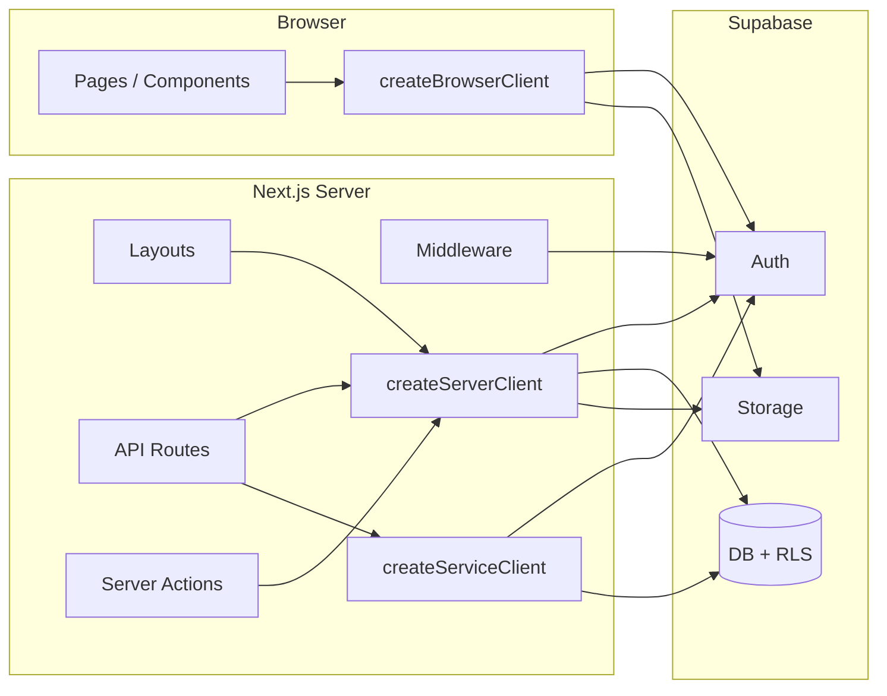

# Architecture Summary

## High-level diagram

## Trust boundaries

| Boundary | What is trusted |
|----------|------------------|
| **Browser** | Only `NEXT_PUBLIC_*` env vars and session cookie. No service role, no webhook secrets. |
| **Server** | Session (cookie) for user context; `getClientId()` from env/config for tenant; service role only in admin/webhook code paths. |
| **Tenant** | `tenant_id` / `client_id` comes from deployment config (`getClientId()`) or from the user's profile (set at login), not from request headers or query params. |

## When to use which Supabase client

| Client | Use when |
|--------|----------|
| **createBrowserClient** (`lib/supabase/client.ts`) | Client components: realtime, auth state, storage upload from UI, any call that must run in the browser. |
| **createServerClient** (`lib/supabase/server.ts`) | Server components, API routes that have a user session (cookies), server actions. RLS applies; tenant is set from `getClientId()` and profile. |
| **createServiceClient** (`lib/supabase/service.ts`) | Admin-only or webhook-only: creating users (invite, create-client), Stripe webhooks, n8n webhooks. RLS is bypassed; use only when anon + RLS cannot do the job. |

## Where tenant_id is set

- **Server:** `createServerClient()` (in `lib/supabase/server.ts`) syncs the user's profile `tenant_id` with `getClientId()` when it differs. RLS policies use `get_current_client_id()`, which reads `profiles.tenant_id` for the current user.
- **Config:** `getClientId()` returns `process.env.NEXT_PUBLIC_CLIENT_ID` or `'default'`. Single-tenant-per-deployment: one env per deployment.

## API surface (auth and rate limits)

| Endpoint | Auth | Rate limit |
|----------|------|------------|
| `GET /api/health` | None | — |
| `GET /auth/callback` | None (code exchange) | 15/min per IP |
| `POST /api/create-client-account` | Cookie (coach) | 20/min per IP |
| `POST /api/invite-client` | Cookie (coach) | 20/min per IP |
| `GET /api/calendar/feed` | Cookie | — |
| `POST /api/webhooks/stripe` | Stripe signature | — |
| `POST /api/webhooks/n8n-video` | Bearer / header secret | — |
| `POST /api/webhooks/n8n-session-booked` | Cookie (user) | — |
| `/login`, `/forgot-password` (page load) | None | 30/min per IP |

## RLS checklist for new tables

When adding a new table that holds tenant or user data:

1. Enable RLS: `ALTER TABLE public.<table> ENABLE ROW LEVEL SECURITY;`
2. Add policies that use `get_current_client_id()` and/or `auth.uid()` so rows are scoped to tenant and role.
3. Prefer server client (`createServerClient`) in app code; use service client only for admin/webhook flows.
4. Document the table and its policies in this doc or in a migration comment.
