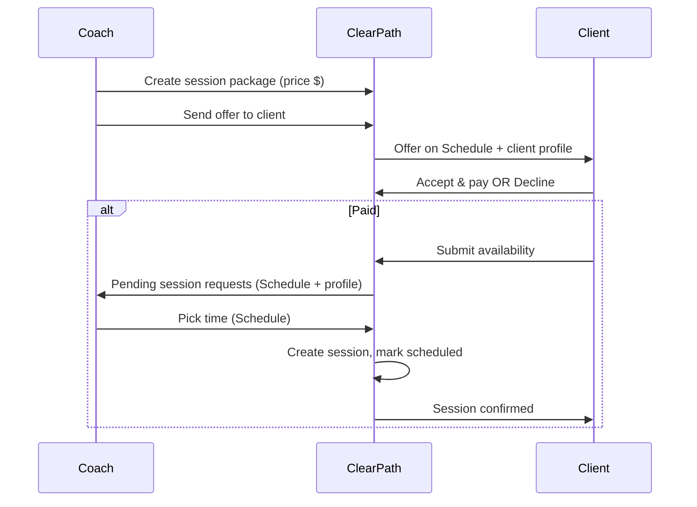

# UX Flows and Copy Guidelines

Companion to [BUILD_PLAN_UI_AND_FLOWS.md](BUILD_PLAN_UI_AND_FLOWS.md), [UI_REVIEW.md](UI_REVIEW.md), and persona reviews. Use for flow diagrams, empty-state/modal specs, and copy standards.

---

## 1. Session offer flow (client ↔ coach)

**Client Schedule states:** Offered → (Accept & pay) → Payment pending → Submit availability → (Coach picks time) → Confirmed. Each step: one primary CTA, clear status label.

---

## 2. Client dashboard priority

1. **Next session** – date, time, link if relevant.
2. **Unpaid/pending offers** – “Accept and pay” or “Submit availability” so the next action is obvious.
3. **Programs / Videos** – shortcuts or “Continue where you left off”.

Empty state: “Nothing scheduled yet. Your coach may send you an offer.” + link to Schedule or Messages.

---

## 3. Coach dashboard priority

1. **Revenue / week** – hero numbers and chart at top.
2. **Next up** – today’s sessions, link to Schedule.
3. **Ready to schedule** – clients who submitted availability, link to Schedule.
4. **Stripe / Revenue & activity** – setup and deep-dive links.

Nav order: Dashboard → Schedule → Clients → Messages → Programs → Videos → Session Packages → Payments → Analytics → Settings.

---

## 4. Empty-state copy (standard)

Replace bare “No X” or “Loading...” with short copy + optional CTA.

| Context | Title / short copy | CTA (optional) |
|--------|---------------------|----------------|
| Coach: No session packages | No session packages yet. Create one to start sending offers. | Create package |
| Coach: Client profile – no session offers | No session offers yet. Send one from Session Packages. | — |
| Coach: Client profile – no programs assigned | No programs assigned. Assign from Programs. | — |
| Coach: Schedule – pending requests (empty) | When clients pay and submit availability, they’ll appear here. | — |
| Client: Schedule – no offers | No session offers right now. Your coach may send one soon. | — |
| Client: Schedule – no sessions | No sessions scheduled. Sessions appear here after you accept an offer and your coach confirms a time. | — |
| Client: Schedule – no slots | No available slots. Your coach will add availability. Check back later. | — |
| Coach/Client: No clients | No clients yet. Add your first client. | Add client |
| Coach: No payments | No payments yet. Record a payment or connect Stripe. | Record payment / Connect Stripe |
| Coach: No messages | No messages yet. Send one below. | — |
| Client: No programs assigned | No programs assigned yet. Your coach will assign programs here. | — |
| Client: No videos | No videos assigned yet. Your coach will assign videos here. | — |
| Coach: No analytics data | No client data yet. | — |
| Loading | Loading… (with spinner or skeleton) | — |

Use a shared **EmptyState** component: icon/illustration slot, title, description, optional button.

---

## 5. Form and validation

- **Required fields:** Mark clearly; validate inline where possible (e.g. Zod on client).
- **Errors:** Inline below field; use FormError with `role="alert"`. Message: short, actionable (e.g. “Enter a valid email”).
- **Success:** Clear feedback (e.g. “Client added”, “Check your email”) with `role="status"` where appropriate. Optional short success animation before close/redirect.

---

## 6. Modal pattern

- **Overlay:** Backdrop (--cp-bg-backdrop); dismiss on overlay click or Escape.
- **Focus trap:** When open, focus moves into modal; Tab cycles within; on close, return focus to trigger.
- **Structure:** Title, body, primary action (right or bottom-right), secondary/cancel (left or “Cancel”).
- **Loading:** On submit, primary button shows spinner + disabled; optional “Sending…” text.

Apply to: Record payment (coach), Request availability (messages), Set name (bulk clients), and any future dialogs.

---

## 7. Navigation

- **Sidebar:** Active item = current page (aria-current="page"). Collapsed state: icon only; ensure tooltip or label on hover so “current page” is still clear.
- **Labels:** Coach vs client nav items match persona; no mixed wording.

---

## 8. Settings

- **Theme mode:** Dark / Light / System – separate control and label.
- **Accent color:** Separate card/label (e.g. “Accent color”) so it’s not confused with “Theme” (mode).
